# UI Screenshots

The following PNG files are included under `docs/assets/screenshots/`. In this sandbox, direct Chromium screenshots of Streamlit were blocked by browser policy, so these are rendered QA screen artifacts from the same UI contract data and diagnosis payloads.

- 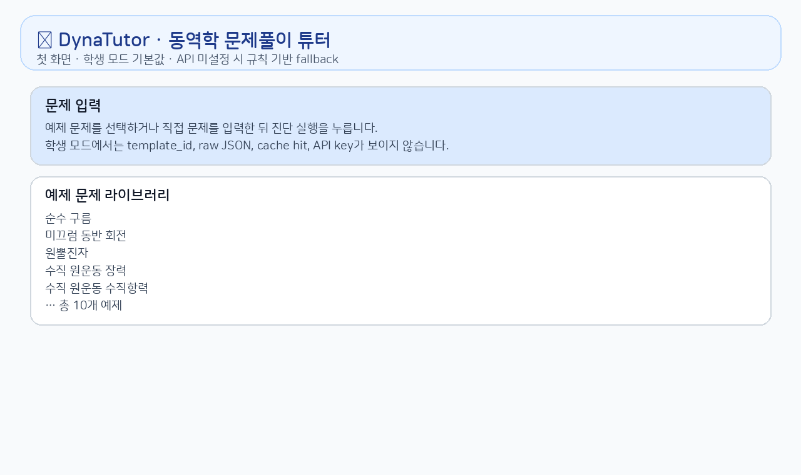
- 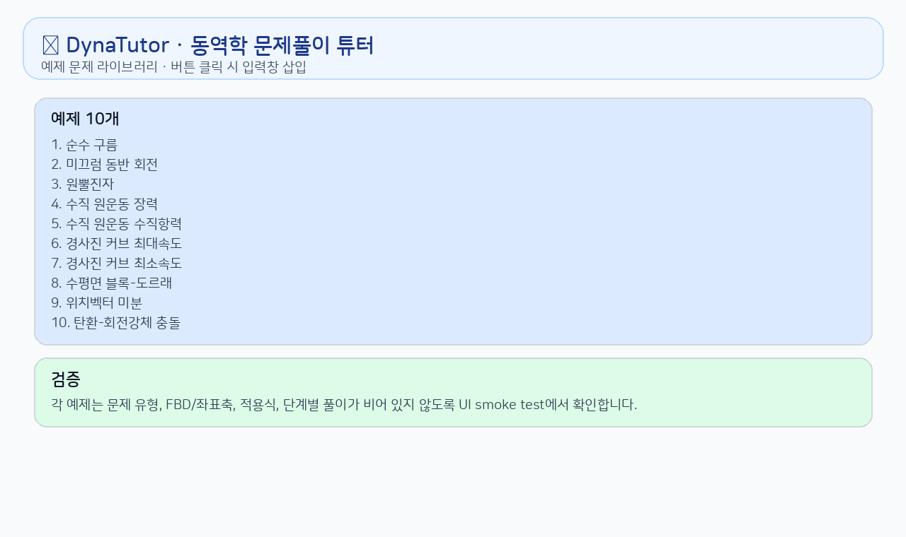
- 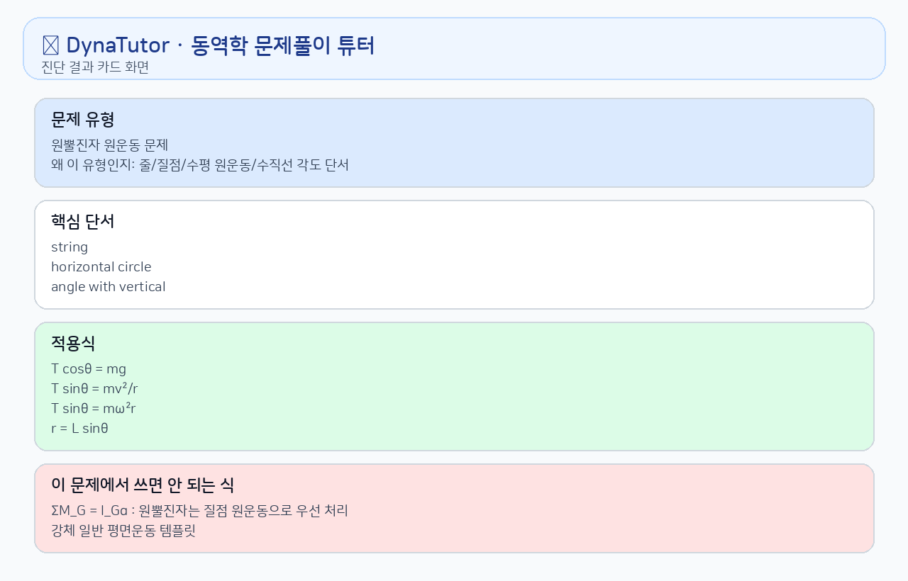
- 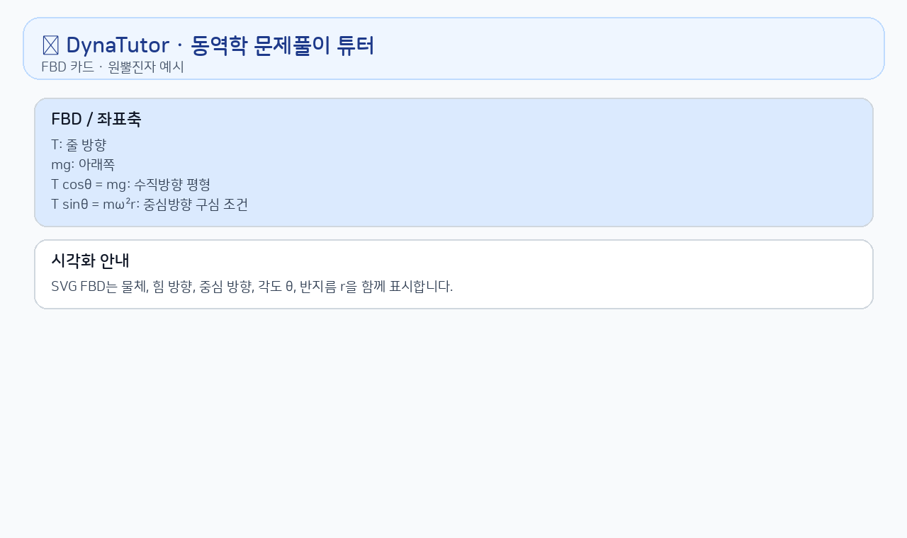
- 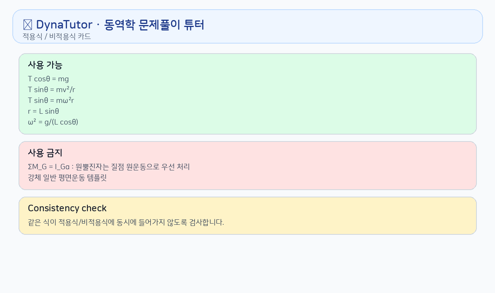
- 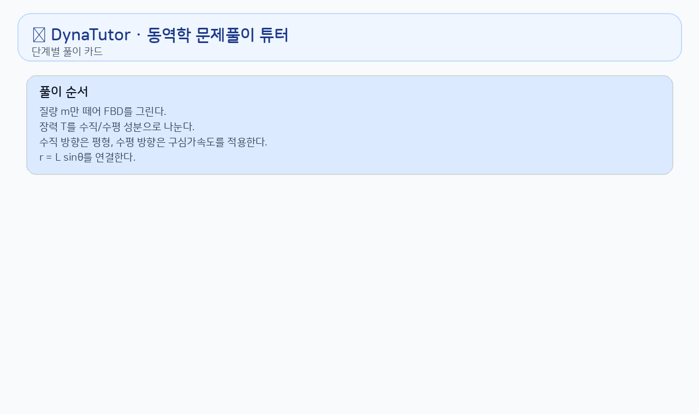
- 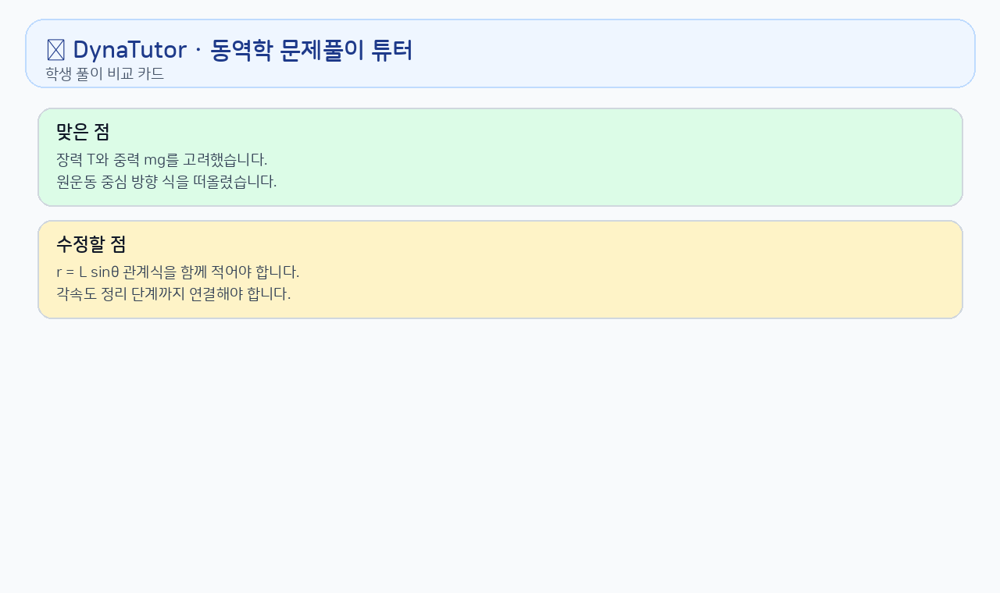
- 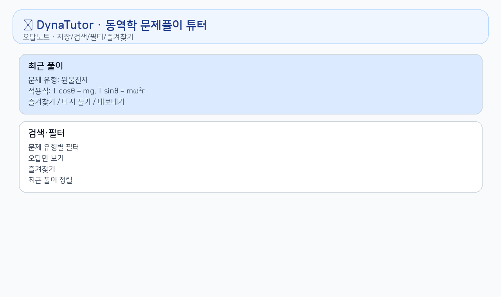
- 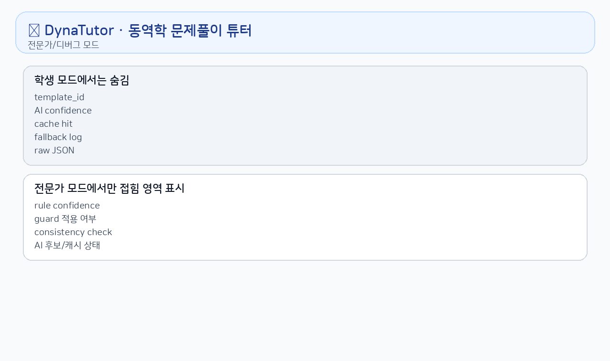
- 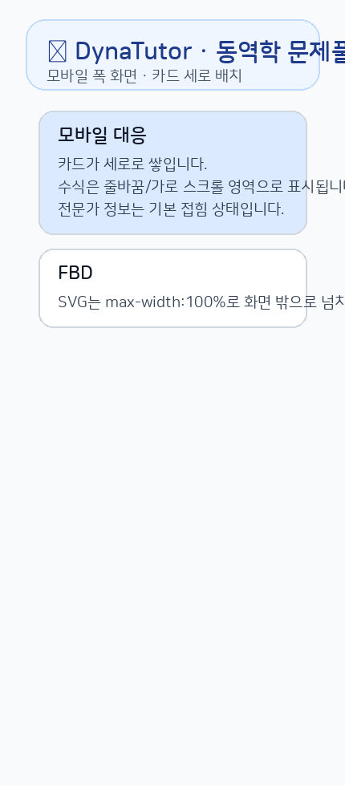
- 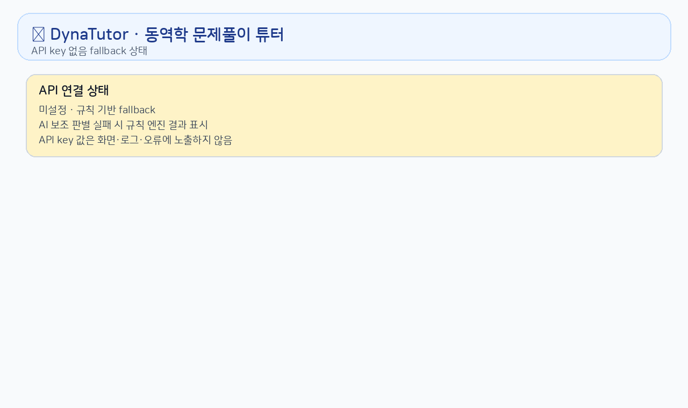
- 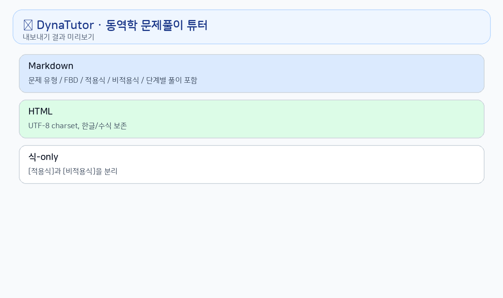